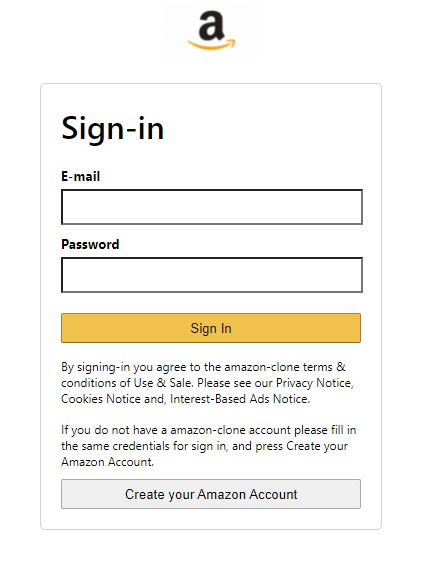
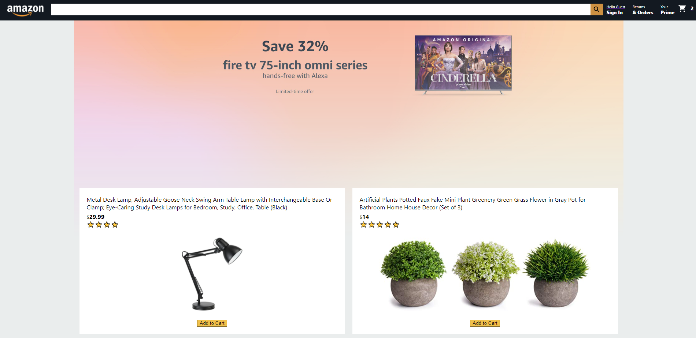
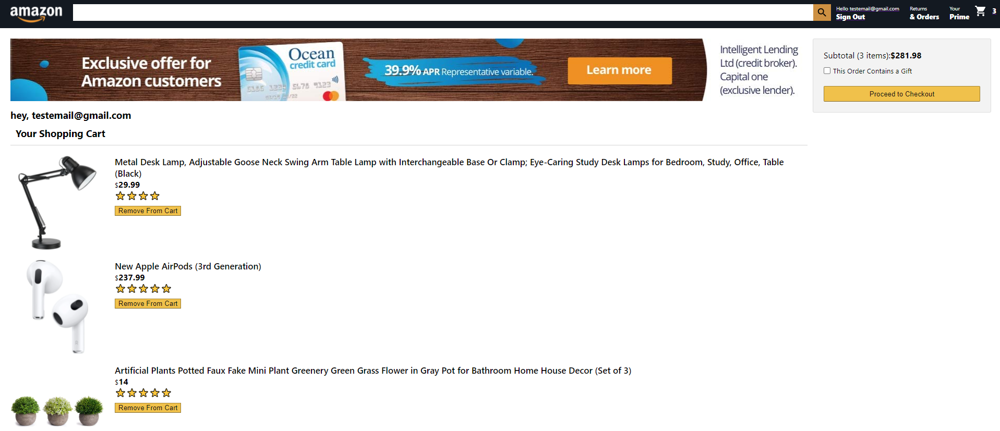

# Full Stack E-commerce-Website

This is the login/register page. Where an existing user can sign in, and a new user can register

This is the home page. Where a user can add any items listed to their cart

This is the checkout page. Where a user can remove any of their items, and see their subtotal

This is the payment page. Where a user can check over their information, remove any items from cart, and continue to payment

## Getting Started with Create React App

This project was bootstrapped with [Create React App](https://github.com/facebook/create-react-app).

## Available Scripts

In the project directory, you can run:

## `npm start`

Runs the app in the development mode.\
Open [http://localhost:3000](http://localhost:3000) to view it in your browser.

The page will reload when you make changes.\
You may also see any lint errors in the console.
